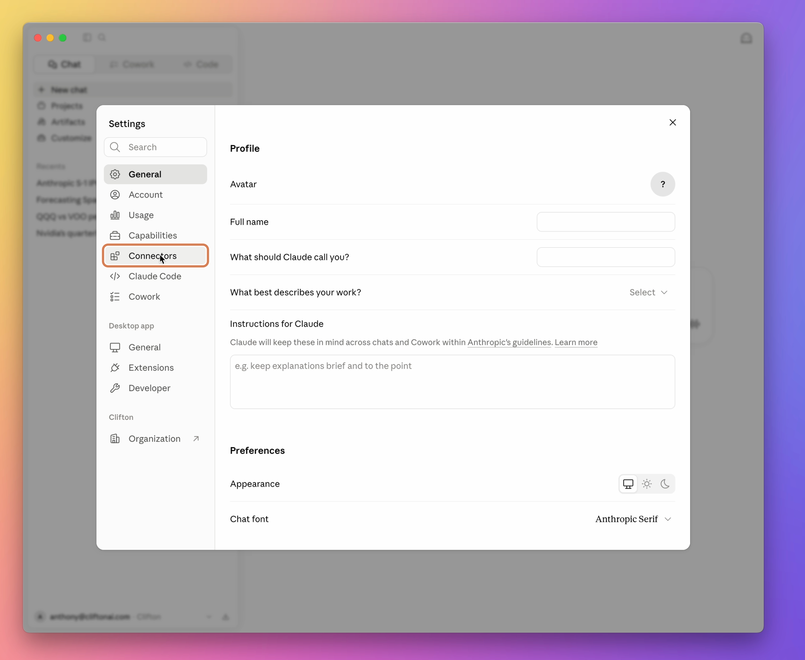
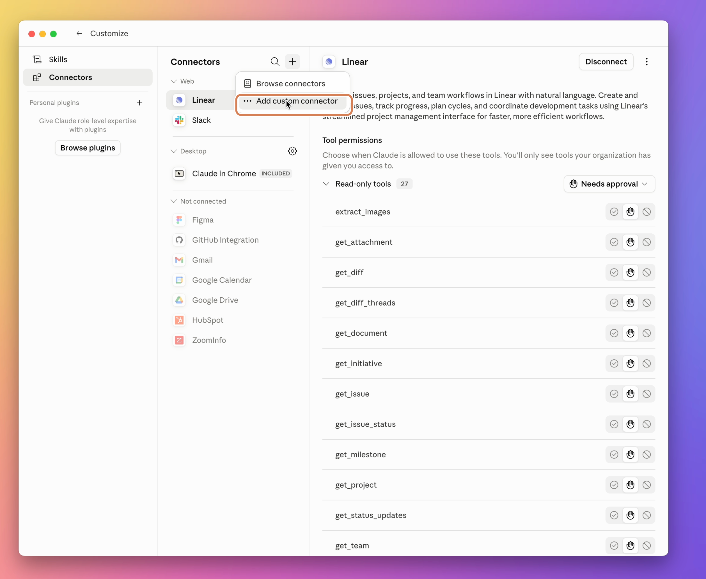
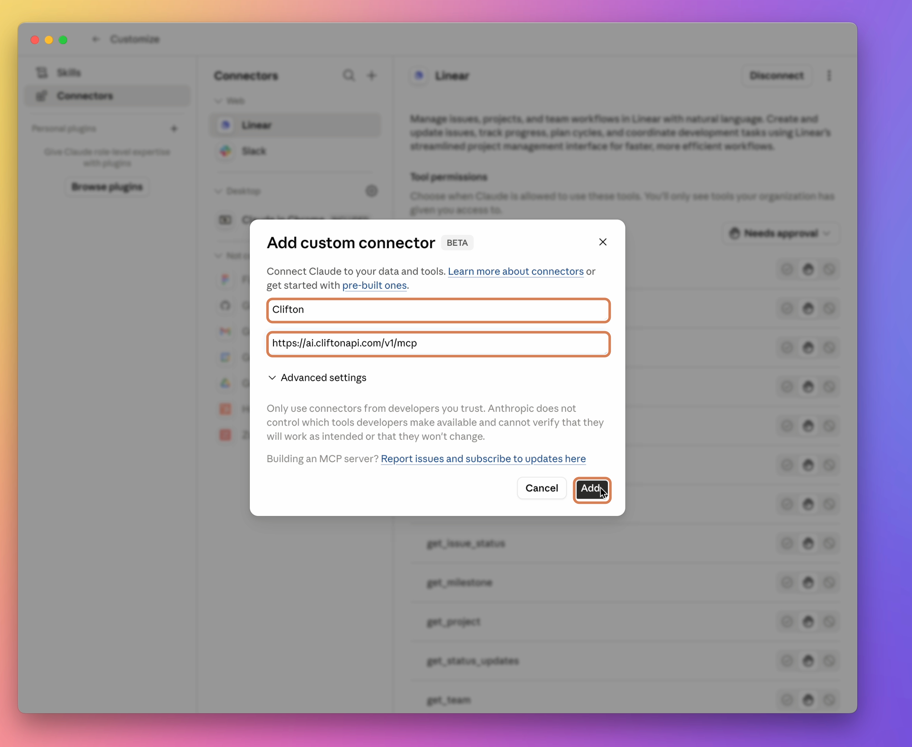

# Connect Clifton over MCP

Clifton's MCP server lets Claude, ChatGPT, and developer CLIs (Claude Code, Cursor, Codex) call `clifton_ask` for markets and finance questions — equities, ETFs, crypto, bonds, options, macro, SEC filings, and earnings. Use it for questions like *"why is NVDA moving today?"* or *"did AAPL add new risk factors in its latest 10-K?"*

OAuth hosts need the MCP URL. API-key hosts need the same URL plus an `X-API-Key` header.

> Looking for the developer reference (schemas, transport, error codes)? See [API.md](API.md).

---

## Before you start

Choose one auth path:

- **OAuth (browser sign-in, no key):** Claude Desktop, Claude Web, Claude Code (via plugin), and ChatGPT workspaces that support custom MCP apps. Sign in with your Clifton account.
- **API key (manual config):** Cursor, Codex, or Claude Code without the plugin. Paste an API key into the host's MCP config.

You'll also need:

1. **A Clifton account** at [console.cliftonapi.com](https://console.cliftonapi.com).
2. **An API key** — only if you're on the API-key path. Grab it from **Settings → API keys** in your Clifton console.

---

## Choose your tool

| Host | Setup method | Time |
|---|---|---|
| **Claude Desktop & Web** | Custom connector + OAuth | < 1 min |
| **ChatGPT Web** | Developer mode + custom MCP app + OAuth | ~ 2 min |
| **Claude Code** (CLI) | Plugin (one command, no key — also adds a skill) or API key | < 1 min |
| **Cursor** | API key + JSON snippet | ~ 2 min |
| **Codex** (CLI) | API key + TOML snippet | ~ 2 min |

> **Tool vs. skill:** Every path connects the same `clifton_ask` tool. The **Claude Code plugin** also installs the `clifton-research` skill, which nudges Claude Code to use Clifton for finance questions. Connector and API-key paths add the tool only.

Use the section for your host. Most people want the first one.

---

# Primary — Claude Desktop & Web

Add Clifton as a **custom connector** over OAuth — no API key. The screenshots use Claude Desktop; Claude Web uses the same connector values.

> 📖 **Canonical steps:** Anthropic's [Connect to remote MCP servers](https://modelcontextprotocol.io/docs/develop/connect-remote-servers) walkthrough (plain-language version: [Get started with custom connectors](https://support.claude.com/en/articles/11175166-getting-started-with-custom-connectors-using-remote-mcp)). If Claude's menus differ from the steps below (the UI moves), follow Anthropic's doc and use Clifton's URL `https://ai.cliftonapi.com/v1/mcp`.

### 1. Open the connector dialog

- **Individual accounts:** click your name → **Settings** or **Customize** → **Connectors** → **+** → **Add custom connector**.
- **Team / Enterprise:** an owner adds the connector under **Organization settings → Connectors**. Members then connect it from their own **Connectors** settings.



Click the **+** button in Connectors, then choose **Add custom connector**.



### 2. Add Clifton

In the dialog:

- **Name:** Clifton
- **Remote MCP server URL:** `https://ai.cliftonapi.com/v1/mcp`

Only those two fields are required. Click **Add**. Claude opens Clifton sign-in — use your `console.cliftonapi.com` credentials.



**On the web** (claude.ai), use the same name and URL. The menu may say **Customize → Connectors** instead of **Settings → Connectors**.

### 3. Verify

Start a new chat and ask:

> What tools does Clifton provide?

Pass condition: Claude lists Clifton and asks permission to call `clifton_ask`.

If Clifton is connected but not available in chat, open the chat **+** menu, choose **Connectors**, and enable Clifton for that conversation.

---

# Secondary — ChatGPT Web

Custom MCP apps in ChatGPT require **Developer mode**. OpenAI currently documents this for ChatGPT Business and Enterprise/Edu workspaces on ChatGPT web, and the setup path changes often, so treat OpenAI's [Developer mode and MCP apps](https://help.openai.com/en/articles/12584461-developer-mode-apps-and-full-mcp-connectors-in-chatgpt-beta) guide as authoritative.

### 1. Enable Developer mode

- **Business:** admins/owners enable Developer mode from **Workspace settings → Apps → Create** or **Settings → Apps → Advanced Settings**.
- **Enterprise / Edu:** admins grant access; enabled users turn it on under **Settings → Apps → Advanced Settings**.
- If you do not see **Apps → Create**, your workspace probably does not have Developer mode enabled.

> Developer mode can enable apps with write actions. Clifton currently exposes only the read-only `clifton_ask` tool, but enable Developer mode deliberately.

### 2. Create the Clifton app

From **Settings → Apps → Create** or **Workspace settings → Apps → Create**, add:

- **Name:** Clifton
- **MCP server URL:** `https://ai.cliftonapi.com/v1/mcp`
- **Auth:** OAuth, if prompted

Scan tools or create the app, then sign in with your Clifton account when prompted.

### 3. Use it

In a chat, select Clifton from the **+** / tools menu, or mention the app by name, then ask a markets or finance question.

> The Clifton OAuth handshake inside ChatGPT has not been end-to-end tested yet. If sign-in fails, send [support](SUPPORT.md) the exact error.

---

# Developer tools (CLIs)

For terminal / editor workflows. The Claude Code **plugin** bundles the `clifton-research` skill (so Claude defaults to Clifton for finance work); Cursor and Codex connect the bare tool via an API key.

## Claude Code

Use the **Clifton plugin** (OAuth, no key). It installs `clifton_ask` **plus** the `clifton-research` skill — so Claude Code automatically routes markets and finance questions to Clifton (sourced from SEC filings + market data). Cursor, Codex, and the connector paths add the tool only.

```text
/plugin marketplace add cliftonai/clifton-mcp
/plugin install clifton-mcp@clifton-mcp
```

The first time you ask a question, Claude Code opens a browser for Clifton sign-in. Then skip to **Your first question** below.

Prefer an API key (no plugin, no skill)? Create one at **Settings → API keys** in the console, then:

```bash
export CLIFTON_API_KEY="paste-your-key-here"
claude mcp add --transport http clifton https://ai.cliftonapi.com/v1/mcp \
  --header "X-API-Key: $CLIFTON_API_KEY"
```

Verify either way: ask *"What tools does Clifton provide?"* — the response lists `clifton_ask`.

> Reference: [Connect Claude Code to tools via MCP](https://code.claude.com/docs/en/mcp) — plugin install, `claude mcp add`, OAuth via `/mcp`.

## Cursor

Create an API key at **Settings → API keys** in the console, then edit `~/.cursor/mcp.json` (create it if missing):

```json
{
  "mcpServers": {
    "clifton": {
      "url": "https://ai.cliftonapi.com/v1/mcp",
      "headers": {
        "X-API-Key": "paste-your-key-here"
      }
    }
  }
}
```

Restart Cursor. (Cursor infers HTTP transport from `url` — no `transport` field needed.)

Verify: in a Cursor chat, ask *"What tools does Clifton provide?"* — it lists `clifton_ask`.

> Reference: [Cursor — Model Context Protocol](https://docs.cursor.com/context/model-context-protocol).

## Codex

Create an API key in the console, then add to `~/.codex/config.toml`:

```toml
[features]
rmcp_client = true   # enables streamable-HTTP MCP servers

[mcp_servers.clifton]
url = "https://ai.cliftonapi.com/v1/mcp"
http_headers = { "X-API-Key" = "paste-your-key-here" }
```

> The table is `mcp_servers` (not `mcp`). Streamable-HTTP MCP requires the RMCP client — `[features].rmcp_client = true` (older builds: `experimental_use_rmcp_client = true` at the top level). Without it Codex expects a stdio `command` and fails with `missing field command`. With the flag, Codex sends `http_headers` natively, so no `transport` field or `mcp-remote` bridge is needed.

Restart Codex and ask *"What tools does Clifton provide?"*

---

## Your first question

Try one of these:

- *Why is NVDA moving today?*
- *How many cars did Tesla sell last quarter?*
- *Did AAPL add any new risk factors in its latest 10-K versus last year?*
- *What did NVDA say about AI capex on its last earnings call?*

Clifton cites the filings, transcripts, releases, or market data it used.

> Tip: answers take roughly 20–40 seconds. Quick lookups, such as a ticker definition or one reported metric, are faster.

---

## Manage access

- **Disconnect OAuth:** remove Clifton from the host's MCP / connector settings.
- **Rotate API key:** create a new key in the Clifton console, update the host config, then delete the old key.
- **Uninstall Claude Code plugin:** run `/plugin uninstall clifton-mcp@clifton-mcp`.

---

## Get help

See [SUPPORT.md](SUPPORT.md) for support contacts, or:

- **Setup not working?** Email `support@cliftonai.com` with `[MCP]` in the subject.
- **Found a bug or unexpected behavior?** Include the host, the question you asked, a screenshot if possible, and the approximate request time.

---

## What's next

- Future tools will appear in `tools/list` and `https://ai.cliftonapi.com/.well-known/mcp-tools.json` when enabled.
- Mobile support depends on Anthropic Connectors Directory availability.
