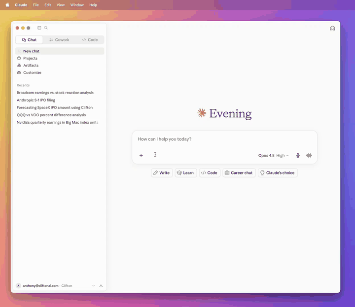

#  Clifton MCP

[](https://github.com/cliftonai/clifton-mcp/actions/workflows/ci.yml)
[](CHANGELOG.md)
[](LICENSE)
[](https://github.com/cliftonai/clifton-mcp/pulls)

Clifton exposes MCP tools for markets and finance research, Data Vault file discovery, and recurring agents. `clifton_ask` answers questions about public companies, ETFs, crypto, bonds, options, and macro data from SEC filings, earnings transcripts, analyst expectations, market data, news, and attached Clifton Data Vault files, then cites the documents or data it used.




**Endpoint:** `https://ai.cliftonapi.com/v1/mcp`

## Quick Start

### Claude Web, Claude Desktop, ChatGPT

In Claude, add a custom connector. In ChatGPT, create a custom MCP app in Developer mode. Use this MCP server URL:

```text
https://ai.cliftonapi.com/v1/mcp
```

Sign in with your Clifton account when prompted. In ChatGPT, custom MCP apps require Developer mode and a supported workspace; the Clifton OAuth flow has not been verified end to end there yet.

**Step-by-step setup for each host →** [INSTALL.md](INSTALL.md)

### Claude Code Plugin

```
/plugin marketplace add cliftonai/clifton-mcp
/plugin install clifton-mcp@clifton-mcp
```

On first use, Claude Code connects to Clifton over OAuth. No Client ID is required. Then ask:

> What was NVDA's most recent reported quarterly revenue?

The plugin also adds a [`clifton-research` skill](plugins/clifton-mcp/skills/clifton-research/SKILL.md) that routes finance questions and agent-management requests to the matching Clifton tools.

### Cursor, Codex, Manual Claude Code

Use an API key from [console.cliftonapi.com](https://console.cliftonapi.com) and pass it as:

```text
X-API-Key: <your-api-key>
```

Config snippets live in [`examples/`](examples/).

## Tools

- **`clifton_ask`** — answers markets & finance questions (equities, ETFs, crypto, bonds, options, macro) from filings, earnings transcripts, analyst expectations, market data, and news; returns citations.
- **`clifton_list_vault_files`:** OAuth and API-key file discovery for Clifton Data Vault. Use returned file IDs in `clifton_ask.attachments`.
- **Agent tools:** `clifton_create_agent` creates a standing monitor through a short conversation; `clifton_delete_agent` removes one owned by an authorized user; `clifton_list_agents`, `clifton_list_agent_reports`, and `clifton_get_agent_report` read agents and reports. Guide: [AGENT-TOOLS.md](AGENT-TOOLS.md).

Full tool reference, auth, and errors: [API.md](API.md).

## Get an account

Sign up at [console.cliftonapi.com](https://console.cliftonapi.com) for an API key and trial. Learn more at [cliftonai.com](https://cliftonai.com).

## Docs

- [INSTALL.md](INSTALL.md) — per-host setup
- [API.md](API.md) — endpoint, auth, tools, errors
- [TROUBLESHOOTING.md](TROUBLESHOOTING.md) — common connection/OAuth/tool issues
- [SUPPORT.md](SUPPORT.md) — how to get help
- [SECURITY.md](SECURITY.md) — vulnerability reporting
- [CHANGELOG.md](CHANGELOG.md) — changes to the tool surface

## Legal

[Privacy Policy](https://cliftonai.com/#/privacy) · [Terms of Service](https://cliftonai.com/#/terms)
